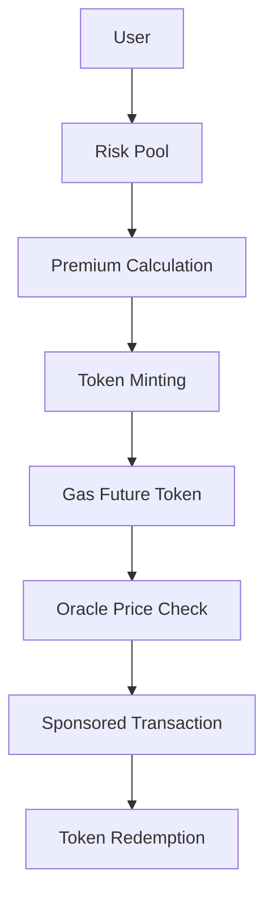

# Gas Futures Protocol - SUI Foundation RFP Solution

> **A comprehensive DeFi protocol for gas futures tokens on the SUI blockchain, enabling users to hedge gas price volatility and secure predictable transaction costs.**

## 🎯 Project Overview

This project addresses the [Sui Foundation's Gas Futures Functionality RFP](https://sui.io/grants/gas-futures-functionality) by implementing a complete solution for gas price hedging on the SUI blockchain. Users can pre-purchase gas credits at predefined prices for future use, providing stability and cost-efficiency similar to commodity futures markets.

### 🌟 Key Features

- **Gas Futures Mechanism**: Pre-purchase gas credits redeemable for future transaction fees
- **Modular Architecture**: Flexible design supporting various gas fee derivatives
- **Advanced Pricing Model**: Fair, transparent pricing with Black-Scholes variant
- **Smart Contract Infrastructure**: Secure issuance, tracking, and redemption
- **Risk Management**: Pooled risk models and automated market makers
- **Emergency Controls**: Pause mechanisms and governance features

## 🏗️ Architecture

### Core Modules

| Module               | Description                                 | Status      |
| -------------------- | ------------------------------------------- | ----------- |
| `futures_token`      | Gas futures token minting and management    | ✅ Complete |
| `risk_pool`          | Risk management and collateral pools        | ✅ Complete |
| `redemption`         | Token redemption and sponsored transactions | ✅ Complete |
| `oracle_integration` | Real-time price feeds and market data       | ✅ Complete |
| `emergency`          | Emergency controls and governance           | ✅ Complete |
| `pricing`            | Advanced pricing models and calculations    | ✅ Complete |
| `global_state`       | Global state management and configuration   | ✅ Complete |

### System Flow



## 🚀 Quick Start

### Prerequisites

- [Sui CLI](https://docs.sui.io/build/install) (latest version)
- [Move](https://move-language.github.io/move/) development environment
- Testnet SUI tokens for deployment

### Installation

```bash
# Clone the repository
git clone https://github.com/your-username/gas-futures.git
cd gas-futures

# Build the project
sui move build

# Run tests
sui move test
```

### Deployment

```bash
# Deploy to testnet
./scripts/deploy_testnet.sh

# Initialize risk pool
sui client call --package $PACKAGE_ID --module risk_pool --function init_risk_pool --gas-budget 10000000
```

## 📊 Pricing Model

### Black-Scholes Variant Formula

```move
let v_sqrt_t = (volatility * sqrt(time_to_expiry)) / 1000;
let premium = (current_gas_price * (10000 + v_sqrt_t)) / 10000;
```

### Risk Management

- **Volatility Index**: Historical volatility tracking
- **Collateral Management**: SUI collateral pools
- **Liquidity Provision**: Incentives for liquidity providers
- **Emergency Mechanisms**: Pause and governance controls

## 🔧 Technical Specifications

### Smart Contract Features

- **Gas Future Token**: ERC-20 compatible with expiry dates
- **Sponsored Transactions**: Zero-cost transaction execution
- **Oracle Integration**: Real-time price feeds
- **Programmable Transactions**: Complex operation support
- **Event System**: Comprehensive event logging

### Security Features

- **Time-based Security**: Automatic token expiry
- **Price Manipulation Protection**: Oracle-based validation
- **Emergency Controls**: Pause and governance mechanisms
- **Audit Ready**: Comprehensive test coverage

## 📈 Economic Model

### Token Economics

- **Strike Price**: Fixed price guarantee
- **Time Value**: Dynamic pricing based on expiry
- **Volatility Premium**: Risk-adjusted pricing
- **Liquidity Incentives**: Provider rewards

### Risk Pool Economics

- **Collateral Requirements**: SUI-based collateral
- **Volatility Index**: Dynamic risk calculation
- **Liquidity Mining**: Provider incentives
- **Governance**: Community-driven updates

## 🧪 Testing

### Test Coverage

```bash
# Run all tests
sui move test

# Run specific module tests
sui move test --filter futures_token
sui move test --filter risk_pool
sui move test --filter redemption
```

### Test Scenarios

- ✅ Token minting and burning
- ✅ Risk pool deposit and withdrawal
- ✅ Oracle price integration
- ✅ Emergency pause and resume
- ✅ Sponsored transaction redemption
- ✅ Pricing model calculations

## 📚 Documentation

- [Architecture Analysis](ARCHITECTURE.md) - Detailed system architecture
- [API Reference](docs/API.md) - Smart contract API documentation
- [User Guide](docs/USER_GUIDE.md) - End-user documentation
- [Developer Guide](docs/DEVELOPER_GUIDE.md) - Integration guide

## 🔗 Integration

### DeepBook Integration

```move
// Example DeepBook integration
use deepbook::pool::Pool;
use deepbook::order_book::OrderBook;
```

### DeFi Infrastructure

- **Wallet Integration**: Standard SUI wallet support
- **DEX Integration**: DeepBook and other DEXs
- **Oracle Networks**: Multiple price feed support
- **Governance**: DAO integration ready

## 🛡️ Security & Audits

### Security Features

- **Formal Verification**: Move Prover integration
- **Audit Ready**: Comprehensive test suite
- **Emergency Controls**: Pause and governance
- **Access Control**: Role-based permissions

### Audit Status

- [ ] Internal Security Review
- [ ] External Audit (Planned)
- [ ] Formal Verification
- [ ] Bug Bounty Program

## 🚀 Roadmap

### Phase 1: MVP (Current)

- ✅ Core smart contracts
- ✅ Basic pricing model
- ✅ Testnet deployment
- ✅ Documentation

### Phase 2: Enhancement

- [ ] Advanced pricing models
- [ ] Cross-chain oracle integration
- [ ] Liquidity mining programs
- [ ] Governance token

### Phase 3: Scale

- [ ] Layer 2 integration
- [ ] Mobile app
- [ ] Advanced analytics
- [ ] Institutional features

## 🤝 Contributing

We welcome contributions! Please see our [Contributing Guide](CONTRIBUTING.md) for details.

### Development Setup

```bash
# Fork and clone
git clone https://github.com/your-username/gas-futures.git

# Install dependencies
sui move build

# Run tests
sui move test

# Submit PR
```

## 📄 License

This project is licensed under the MIT License - see the [LICENSE](LICENSE) file for details.

## 📞 Contact

- **Project Link**: [https://github.com/your-username/gas-futures](https://github.com/nzengi/gas-futures)
- **Issues**: [GitHub Issues](https://github.com/nzengi/gas-futures/issues)
- **Discussions**: [GitHub Discussions](https://github.com/nzengi/gas-futures/discussions)

---

**Built with ❤️ for the SUI ecosystem**
