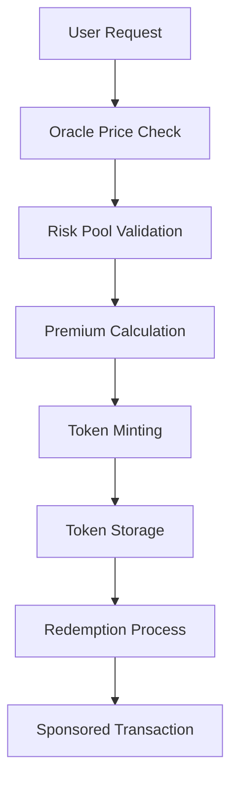

# Gas Futures Protocol - Developer Guide

## Introduction

This developer guide provides comprehensive information for integrating with the Gas Futures Protocol. Whether you're building a DeFi application, wallet integration, or custom trading interface, this guide will help you understand the technical implementation and best practices.

## Architecture Overview

### Smart Contract Modules

The protocol consists of seven core modules:

```move
sources/
├── futures_token.move      // Token minting and management
├── risk_pool.move         // Risk management and liquidity
├── redemption.move        // Token redemption and sponsored transactions
├── oracle_integration.move // Price feeds and market data
├── emergency.move         // Emergency controls and governance
├── pricing.move           // Advanced pricing models
└── global_state.move      // Global state management
```

### Data Flow



## Integration Patterns

### 1. Direct Smart Contract Integration

#### Basic Token Purchase

```move
// Example: Purchase gas futures token
public entry fun purchase_gas_futures(
    treasury: &mut TreasuryCap<GasFutureToken>,
    buyer: address,
    gas_units: u64,
    strike_price: u64,
    expiry: u64,
    ctx: &mut TxContext
) {
    futures_token::mint(
        treasury,
        buyer,
        gas_units,
        strike_price,
        expiry,
        ctx
    );
}
```

#### Token Redemption

```move
// Example: Redeem token for sponsored transaction
public entry fun redeem_for_transaction(
    token: GasFutureToken,
    pool: &mut RiskPool,
    clock: &Clock,
    ctx: &mut TxContext
) {
    redemption::redeem(token, pool, clock, ctx);
}
```

### 2. Web3 Integration

#### JavaScript/TypeScript Integration

```typescript
import { TransactionBlock } from "@mysten/sui.js/transactions";
import { SuiClient } from "@mysten/sui.js/client";

class GasFuturesClient {
  private client: SuiClient;
  private packageId: string;

  constructor(client: SuiClient, packageId: string) {
    this.client = client;
    this.packageId = packageId;
  }

  async purchaseToken(
    treasuryCap: string,
    gasUnits: number,
    strikePrice: number,
    expiry: number
  ) {
    const txb = new TransactionBlock();

    txb.moveCall({
      target: `${this.packageId}::futures_token::mint`,
      arguments: [
        txb.object(treasuryCap),
        txb.pure(await this.client.getActiveAddress()),
        txb.pure(gasUnits),
        txb.pure(strikePrice),
        txb.pure(expiry),
      ],
    });

    return await this.client.signAndExecuteTransactionBlock({
      transactionBlock: txb,
      requestType: "WaitForLocalExecution",
    });
  }

  async redeemToken(tokenId: string, riskPoolId: string, clockId: string) {
    const txb = new TransactionBlock();

    txb.moveCall({
      target: `${this.packageId}::redemption::redeem`,
      arguments: [
        txb.object(tokenId),
        txb.object(riskPoolId),
        txb.object(clockId),
      ],
    });

    return await this.client.signAndExecuteTransactionBlock({
      transactionBlock: txb,
      requestType: "WaitForLocalExecution",
    });
  }

  async getTokenBalance(address: string): Promise<GasFutureToken[]> {
    const objects = await this.client.getOwnedObjects({
      owner: address,
      filter: {
        Package: this.packageId,
      },
    });

    return objects.data
      .filter((obj) => obj.data?.type?.includes("GasFutureToken"))
      .map((obj) => obj.data as GasFutureToken);
  }
}
```

#### React Integration

```typescript
import React, { useState, useEffect } from "react";
import { useWallet } from "@suiet/wallet-kit";
import { GasFuturesClient } from "./GasFuturesClient";

const GasFuturesComponent: React.FC = () => {
  const { connected, account } = useWallet();
  const [client, setClient] = useState<GasFuturesClient | null>(null);
  const [tokens, setTokens] = useState<GasFutureToken[]>([]);

  useEffect(() => {
    if (connected && account) {
      const gasFuturesClient = new GasFuturesClient(
        window.suiWallet,
        process.env.REACT_APP_PACKAGE_ID!
      );
      setClient(gasFuturesClient);
    }
  }, [connected, account]);

  const purchaseToken = async () => {
    if (!client) return;

    try {
      await client.purchaseToken(
        process.env.REACT_APP_TREASURY_CAP!,
        1000, // gas units
        100, // strike price
        Date.now() + 30 * 24 * 60 * 60 * 1000 // 30 days
      );
    } catch (error) {
      console.error("Purchase failed:", error);
    }
  };

  return (
    <div>
      <h2>Gas Futures Protocol</h2>
      {connected ? (
        <div>
          <button onClick={purchaseToken}>Purchase Gas Futures</button>
          <div>
            <h3>Your Tokens</h3>
            {tokens.map((token) => (
              <div key={token.id}>
                <p>Gas Units: {token.gas_units}</p>
                <p>Strike Price: {token.strike_price}</p>
                <p>Expiry: {new Date(token.expiry).toLocaleDateString()}</p>
              </div>
            ))}
          </div>
        </div>
      ) : (
        <p>Please connect your wallet</p>
      )}
    </div>
  );
};
```

### 3. Mobile App Integration

#### React Native Example

```typescript
import { SuiClient } from "@mysten/sui.js/client";
import { TransactionBlock } from "@mysten/sui.js/transactions";

class MobileGasFutures {
  private client: SuiClient;
  private packageId: string;

  constructor(rpcUrl: string, packageId: string) {
    this.client = new SuiClient({ url: rpcUrl });
    this.packageId = packageId;
  }

  async purchaseToken(
    treasuryCap: string,
    gasUnits: number,
    strikePrice: number,
    expiry: number,
    walletAddress: string
  ) {
    const txb = new TransactionBlock();

    txb.moveCall({
      target: `${this.packageId}::futures_token::mint`,
      arguments: [
        txb.object(treasuryCap),
        txb.pure(walletAddress),
        txb.pure(gasUnits),
        txb.pure(strikePrice),
        txb.pure(expiry),
      ],
    });

    return txb;
  }

  async getTokenInfo(tokenId: string) {
    const object = await this.client.getObject({
      id: tokenId,
      options: { showContent: true },
    });

    return object.data?.content as GasFutureToken;
  }
}
```

### 4. Backend Integration

#### Node.js API Example

```typescript
import express from "express";
import { SuiClient } from "@mysten/sui.js/client";
import { GasFuturesClient } from "./GasFuturesClient";

const app = express();
const client = new SuiClient({ url: process.env.SUI_RPC_URL });
const gasFutures = new GasFuturesClient(client, process.env.PACKAGE_ID);

app.post("/api/purchase-token", async (req, res) => {
  try {
    const { treasuryCap, gasUnits, strikePrice, expiry, buyerAddress } =
      req.body;

    const result = await gasFutures.purchaseToken(
      treasuryCap,
      gasUnits,
      strikePrice,
      expiry,
      buyerAddress
    );

    res.json({ success: true, transaction: result });
  } catch (error) {
    res.status(500).json({ error: error.message });
  }
});

app.get("/api/tokens/:address", async (req, res) => {
  try {
    const tokens = await gasFutures.getTokenBalance(req.params.address);
    res.json({ tokens });
  } catch (error) {
    res.status(500).json({ error: error.message });
  }
});

app.listen(3000, () => {
  console.log("Gas Futures API running on port 3000");
});
```

## DeepBook Integration

### Creating Gas Futures Markets

```move
use deepbook::pool::Pool;
use deepbook::order_book::OrderBook;

public entry fun create_gas_futures_market(
    pool: &mut Pool,
    base_coin: TypeName,
    quote_coin: TypeName,
    ctx: &mut TxContext
) {
    // Create order book for gas futures trading
    let order_book = order_book::create_order_book(
        base_coin,
        quote_coin,
        ctx
    );

    // Register with DeepBook
    pool::add_order_book(pool, order_book, ctx);
}
```

### Trading Gas Futures

```move
public entry fun place_gas_futures_order(
    pool: &mut Pool,
    order_book: &mut OrderBook,
    side: bool, // true for buy, false for sell
    price: u64,
    quantity: u64,
    ctx: &mut TxContext
) {
    order_book::place_order(
        order_book,
        side,
        price,
        quantity,
        ctx
    );
}
```

## Oracle Integration

### Custom Oracle Implementation

```move
use sui::price_oracle::PriceOracle;

public struct CustomGasOracle has key {
    id: UID,
    price_oracle: PriceOracle,
    last_update: u64,
}

public entry fun init_custom_oracle(
    price_oracle: PriceOracle,
    ctx: &mut TxContext
) {
    let oracle = CustomGasOracle {
        id: object::new(ctx),
        price_oracle,
        last_update: 0,
    };

    transfer::share_object(oracle);
}

public fun get_gas_price(oracle: &CustomGasOracle): u64 {
    price_oracle::get_price(&oracle.price_oracle, "SUI/USD")
}
```

## Testing Integration

### Unit Tests

```move
#[test_only]
module gas_futures::integration_tests {
    use sui::test_scenario::{Self, Scenario};
    use gas_futures::futures_token::{Self, GasFutureToken};
    use gas_futures::risk_pool::{Self, RiskPool};

    #[test]
    fun test_complete_workflow() {
        let scenario = test_scenario::begin(@0x1);

        // Setup
        test_scenario::next_tx(&mut scenario, @0x1);
        {
            // Initialize risk pool
            risk_pool::init_risk_pool(test_scenario::ctx(&mut scenario));
        };

        // Purchase token
        test_scenario::next_tx(&mut scenario, @0x2);
        {
            futures_token::mint(
                &mut test_scenario::take_from_sender<treasury_cap::TreasuryCap<GasFutureToken>>(&scenario),
                @0x2,
                1000,
                100,
                1735689600,
                test_scenario::ctx(&mut scenario)
            );
        };

        test_scenario::end(scenario);
    }
}
```

### Integration Tests

```typescript
import { GasFuturesClient } from "../src/GasFuturesClient";
import { SuiClient } from "@mysten/sui.js/client";

describe("Gas Futures Integration Tests", () => {
  let client: GasFuturesClient;

  beforeEach(() => {
    const suiClient = new SuiClient({ url: "https://fullnode.testnet.sui.io" });
    client = new GasFuturesClient(suiClient, "test-package-id");
  });

  test("should purchase gas futures token", async () => {
    const result = await client.purchaseToken(
      "test-treasury-cap",
      1000,
      100,
      Date.now() + 30 * 24 * 60 * 60 * 1000
    );

    expect(result.effects?.status.status).toBe("success");
  });

  test("should redeem token successfully", async () => {
    const result = await client.redeemToken(
      "test-token-id",
      "test-risk-pool-id",
      "test-clock-id"
    );

    expect(result.effects?.status.status).toBe("success");
  });
});
```

## Security Best Practices

### 1. Input Validation

```move
public entry fun safe_mint(
    treasury: &mut TreasuryCap<GasFutureToken>,
    buyer: address,
    gas_units: u64,
    strike_price: u64,
    expiry: u64,
    ctx: &mut TxContext
) {
    // Validate inputs
    assert!(gas_units > 0, EINVALID_GAS_UNITS);
    assert!(strike_price > 0, EINVALID_STRIKE_PRICE);
    assert!(expiry > timestamp::now_seconds(ctx), EINVALID_EXPIRY);

    futures_token::mint(treasury, buyer, gas_units, strike_price, expiry, ctx);
}
```

### 2. Access Control

```move
public entry fun admin_only_function(
    admin_cap: &AdminCap,
    ctx: &mut TxContext
) {
    // Only admin can call this function
    assert!(admin_cap.admin == tx_context::sender(ctx), ENOT_AUTHORIZED);

    // Function implementation
}
```

### 3. Reentrancy Protection

```move
public entry fun protected_function(
    pool: &mut RiskPool,
    ctx: &mut TxContext
) {
    // Check if contract is paused
    assert!(!pool.is_paused, ECONTRACT_PAUSED);

    // Function implementation with reentrancy protection
}
```

## Performance Optimization

### 1. Batch Operations

```move
public entry fun batch_mint(
    treasury: &mut TreasuryCap<GasFutureToken>,
    buyers: vector<address>,
    gas_units: vector<u64>,
    strike_prices: vector<u64>,
    expiries: vector<u64>,
    ctx: &mut TxContext
) {
    let i = 0;
    while (i < vector::length(&buyers)) {
        futures_token::mint(
            treasury,
            *vector::borrow(&buyers, i),
            *vector::borrow(&gas_units, i),
            *vector::borrow(&strike_prices, i),
            *vector::borrow(&expiries, i),
            ctx
        );
        i = i + 1;
    };
}
```

### 2. Gas Optimization

```move
// Use efficient data structures
public struct OptimizedToken has key, store {
    id: UID,
    data: vector<u8>, // Packed data for efficiency
}

// Minimize storage operations
public fun update_token_data(
    token: &mut OptimizedToken,
    new_data: vector<u8>
) {
    token.data = new_data;
}
```

## Error Handling

### Custom Error Types

```move
const EINSUFFICIENT_BALANCE: u64 = 0;
const ETOKEN_EXPIRED: u64 = 1;
const EINVALID_PRICE: u64 = 2;
const ECONTRACT_PAUSED: u64 = 3;

public fun handle_errors(result: bool, error_code: u64) {
    if (!result) {
        abort error_code;
    };
}
```

### Client-Side Error Handling

```typescript
class GasFuturesError extends Error {
  constructor(message: string, public code: number, public transaction?: any) {
    super(message);
    this.name = "GasFuturesError";
  }
}

async function safePurchase(client: GasFuturesClient, params: any) {
  try {
    return await client.purchaseToken(params);
  } catch (error) {
    if (error.message.includes("InsufficientBalance")) {
      throw new GasFuturesError("Insufficient balance", 0, error);
    }
    if (error.message.includes("TokenExpired")) {
      throw new GasFuturesError("Token has expired", 1, error);
    }
    throw error;
  }
}
```

## Monitoring and Analytics

### Event Tracking

```typescript
class GasFuturesAnalytics {
  async trackEvent(event: string, data: any) {
    await fetch("/api/analytics", {
      method: "POST",
      headers: { "Content-Type": "application/json" },
      body: JSON.stringify({ event, data, timestamp: Date.now() }),
    });
  }

  async trackPurchase(gasUnits: number, strikePrice: number) {
    await this.trackEvent("token_purchased", {
      gas_units: gasUnits,
      strike_price: strikePrice,
      timestamp: Date.now(),
    });
  }
}
```

### Health Monitoring

```typescript
class ProtocolHealthMonitor {
  async checkRiskPoolHealth(poolId: string): Promise<boolean> {
    const pool = await this.client.getObject({ id: poolId });
    const collateral = pool.data?.content?.collateral;
    return collateral > this.minimumCollateral;
  }

  async getProtocolStats() {
    const globalState = await this.client.getObject({
      id: this.globalStateId,
    });
    return globalState.data?.content;
  }
}
```

## Deployment Guide

### 1. Testnet Deployment

```bash
#!/bin/bash
# deploy_testnet.sh

echo "Deploying Gas Futures Protocol to testnet..."

# Build the project
sui move build

# Deploy to testnet
sui client publish --gas-budget 100000000 --skip-dependency-verification

# Get package ID
PACKAGE_ID=$(sui client publish --gas-budget 100000000 --skip-dependency-verification | grep -o '0x[a-fA-F0-9]*' | head -1)

echo "Package deployed with ID: $PACKAGE_ID"

# Initialize components
sui client call --package $PACKAGE_ID --module risk_pool --function init_risk_pool --gas-budget 10000000
sui client call --package $PACKAGE_ID --module emergency --function init_emergency_switch --gas-budget 10000000
sui client call --package $PACKAGE_ID --module pricing --function init_pricing_model --args 100 --gas-budget 10000000
sui client call --package $PACKAGE_ID --module global_state --function init_global_state --gas-budget 10000000

echo "Deployment complete!"
```

### 2. Mainnet Deployment Checklist

- [ ] Complete security audit
- [ ] Test all functionality on testnet
- [ ] Verify oracle integrations
- [ ] Set up monitoring and alerting
- [ ] Prepare emergency procedures
- [ ] Deploy with proper access controls

## Support and Resources

### Documentation Links

- [API Reference](API.md)
- [Architecture Guide](ARCHITECTURE.md)
- [User Guide](USER_GUIDE.md)

### Community Resources

- **Discord**: Technical discussions and support
- **GitHub**: Issue tracking and contributions
- **Documentation**: Comprehensive guides and examples

### Getting Help

- **Technical Issues**: Create GitHub issue
- **Integration Questions**: Join Discord community
- **Security Concerns**: Contact security team

---

**Happy Building! 🚀**

_This developer guide is part of the SUI Foundation Gas Futures Functionality RFP solution._
